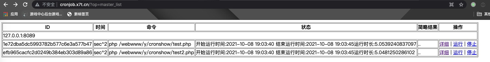

# cronshow
基于workerman做的定时任务控制台,Linux 定时任务控制，比linux自带的cronjob增加秒级功能。

# 运行环境
1. php >= 7.0
   php扩展需要 pcntl libevent
2. Linux
3. 预留7788与8877和8089端口

# 使用教程
## 安装
1. 下载完项目之后，在根composer install一下,主要加载workerman的库（phper都该懂composer ^_^）
`
composer install
`

1. 首次设置要把Application/Config_example 复制文件夹到Application/Config

## 配置
配置要启动的job
Application/config下的配置文件
代码里Config_example --> Config

### 按天运行
```PHP
// Day.php 每天某个时刻的运行
// 例如每天10点15分运行一次
return [
    "10:15" => [
    "echo no",
    "sh /test/test.sh"
    ]
];
```
### 按分钟运行
```PHP
// Minute.php 每隔多少分钟运行一次
// 每1钟01秒运行一次
return [
    "1" => [
    "echo no"
    ]
];
```
### 按秒运行
```PHP
Second.php 每隔多少秒运行一次
// 每5秒运行一次
return [
    "5" => [
    "echo no"
    ]
];
```

## web管理的配置
```PHP
// Web.php web管理
// ip:8089, 也可以使用nginx反向代理一下
return [
    //agent的描述
    "agent_id" => "test",
    "ip" => "0.0.0.0",
    "port" => "8089",
    "server" => "127.0.0.1",
    // 需要访问的agent,一般是ip+8089
    "client" => [
        // '172.17.0.5:8089',
        '127.0.0.1:8089'
    ],
    "key" => "test",
    // 需要登录跳转的登录地址
    "login_url" => "http://www.baidu.com",
    //  是否自动跳去登录
    "autoredirectloginurl" => false,
];
## 权限逻辑文件
// Config\Acl.php 这里加上登录逻辑，默认return true即校验成功

```
运行web界面，可以启动或停止相关进程。
### 查看web管理
`
http://127.0.0.1:8089?op=master_list
`

效果如下:



# 命令相关
## 测试运行效果
php job.php start, 会输出运行信息

## 运行cron服务
本根目录运行以下命令即可
php job.php start -d

## 停止服务
php job.php stop

# todo
1. 添加队列运行（之前是队列运行，后改成并行，现在还需要根据配置来队列运行）
2. 增加钉钉通知